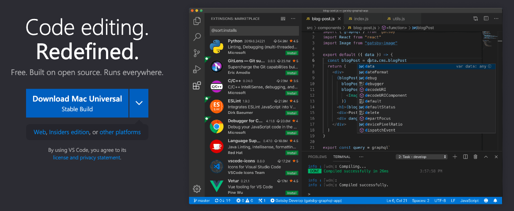
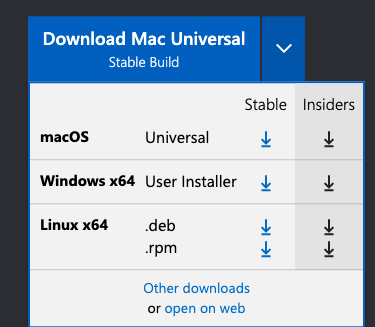
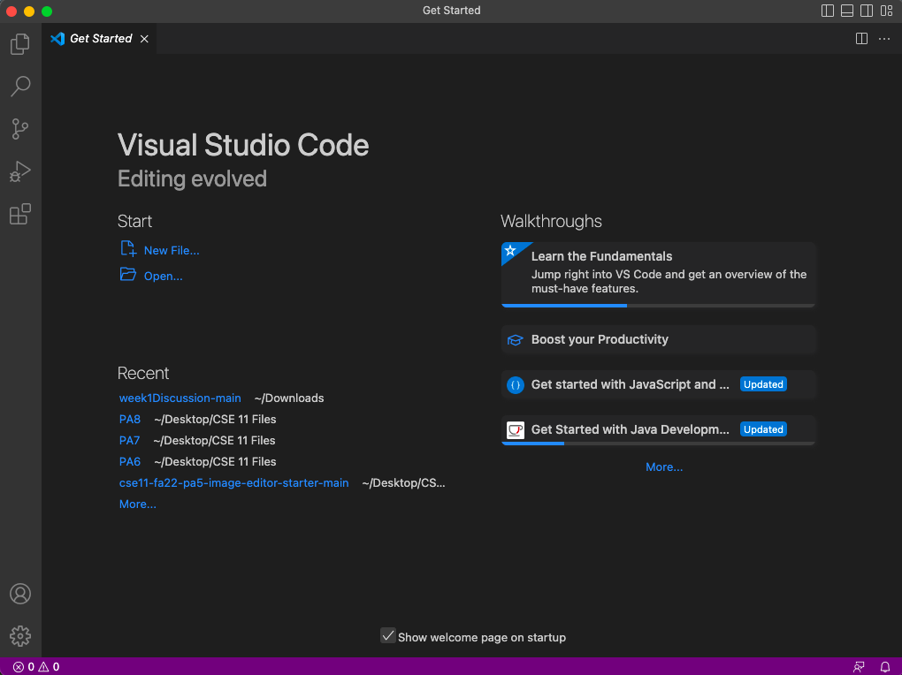
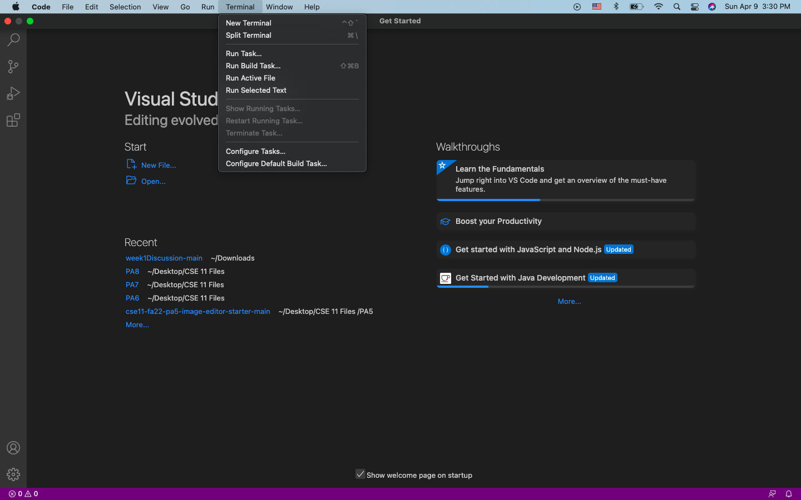
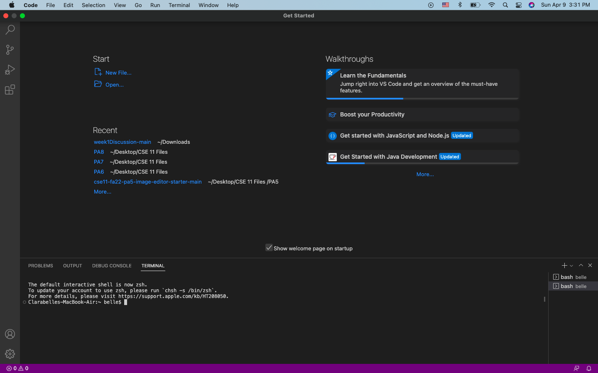
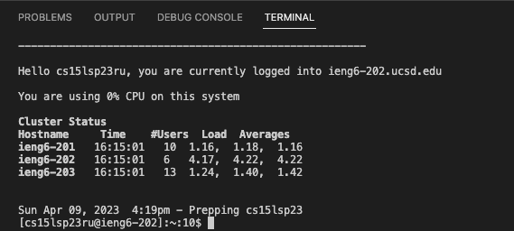
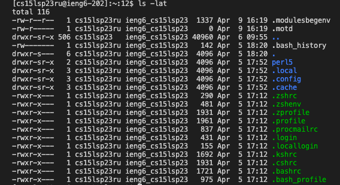
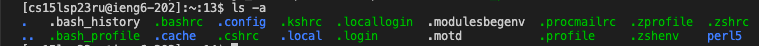
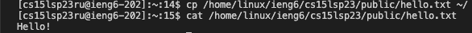

# Lab Report 1 - Remote Access & FileSystem
## Creating a Course-Specific Account
Look up your course-specific account on here: 
[Link](https://sdacs.ucsd.edu/~icc/index.php)

The Username is the first part of your email but **omit everything after the @**

Example:
> Email: ccl011@ucsd.edu
> 
> Username: ccl011

### Resetting your Password
If you need to reset your password:
1. Click on the button under "Additional Accounts"
2. Click "Global Password Change Tool" within the orange box
3. Click "Proceed to the Password Change Tool"
4. Follow all the directions

## Installing Visual Studio Code
To download the application, go to the Visual Studio Code website ([Link](https://code.visualstudio.com/))

Click on the big blue download button
* If you have a different operating system, click on the dropdown menu and select your respective OS

Opening the application should give you a screen like this:

Don't mind the files under "Recent"!

## Remotely Connecting
Since I have a MacBook, I did not have to worry about installing *git* 

To open a new Terminal, I put my cursor to the top of the screen and clicked on "Terminal"

Then you click "New Terminal" and it should look like this:

We now want to connect to the server by inputting:

`$ ssh cs15lsp23ru@ieng6.ucsd.edu`
* Make sure not to include "$" as the terminal already provides it for you

Take out the two letters "ru" and replace it with your two letters from your log-in info

Example:
> My log-in: cs15lsp23ru@ieng6.ucsd.edu
> 
> Change: cs15lsp23~~ru~~@ieng6.ucsd.edu
> 
> Example: cs15lsp23st@ieng6.ucsd.edu

Connecting to the server for the first time would give you something like:

> The authenticity of host 'ieng6.ucsd.edu (128.54.70.227)' can't be established.
> RSA key fingerprint is SHA256:ksruYwhnYH+sySHnHAtLUHngrPEyZTDl/1x99wUQcec.
> Are you sure you want to continue connecting (yes/no/[fingerprint])?

Type `yes` then press "enter" on your keyboard to get connected.

Since I have already connected to it before, it will just ask for a password:

Input your password from your course-specific account
* When typing in your password it may seem like it's not working, but it actually is! Try to remember what characters you've already typed in.
* If you recently changed your password, it will probably take a bit for the password to be updated so please wait a bit!

Successfully inputting your password will give you this:

Now you're connected to the servers in the CSE Basement! Congrats!!

## Trying some Commands
Now we can input some commands that were given to us in the lab.

For me, running `cd ~` and `cd` did not work/did not have any output:

However, inputting `ls -lat` and `ls -a` gave me some information:

The last two commands I tried were:

`cp /home/linux/ieng6/cs15lsp23/public/hello.txt ~/`

`cat /home/linux/ieng6/cs15lsp23/public/hello.txt`

The first command didn't output anything, while the second one outputted "Hello!"

Maybe if I were using a different computer something could possibly be outputted.

Once you're done using the remote server, make sure to use the command `exit` to log out!
