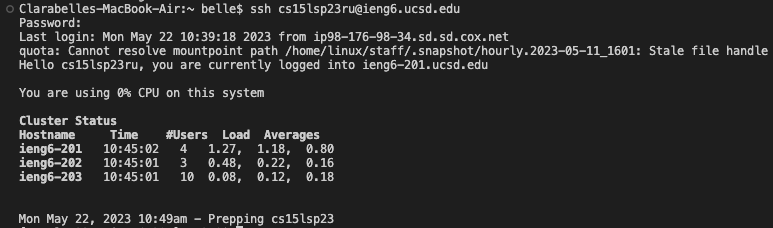

# Lab Report 4 - Command Line

First I logged into the remote server with:

`ssh cs15lsp23ru@ieng6.ucsd.edu`

then pressed `<Enter>`.

This screen indicated that I logged in:
  

  
After that, I made a clone of my fork of the repository by typing:
  
`git clone https://github.com/CBelleLopez/lab7.git`
  
then pressed `<Enter>` to confirm.
  
This is what shows up after running the command:
  

I made sure to `cd` into lab7 so that I could run the tests by typing:
  
`bash test.sh`
  
The picture below indicates that the tests fail:
  

  
To edit the file causing the errors, we have to use `vim` so we type:
  
`vim ListExamples.java`
  
The file should open up and looks like this:
  

  
To navigate where the error is, I started typing in `/while(index2` then pressed `<Enter>`. Next I pressed
`<j><j><j><2w><h><h>` then deleted the "1" by pressing `<x>`. To insert "2", I pressed `<i><2>`. To exit 
insert mode, I pressed `<esc>` and to save the changes I've made, I typed in `:wq`.

This is what it should look like after the change has been made:

  
This is what should show up after running `bash test.sh` again:
  

  
To commit and push the changes to my Github account, I ran the command:
  
`git add ListExamples.java` then `git commit`
  
The changes should show up like this after a commit message is added:
  

