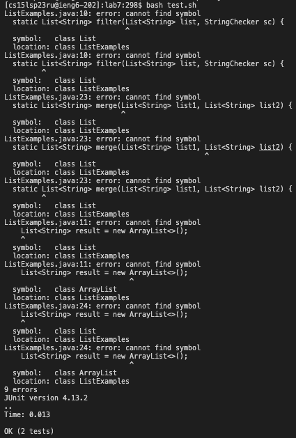
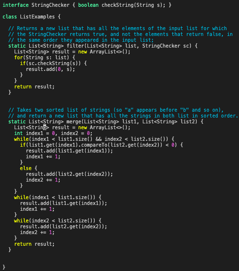
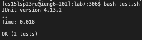

# Lab Report 5 - Debugging
## Debugging Scenario
Below is a makeshift debugging scenario on EdStem:

> What environment are you using (computer, operating system, web browser, terminal/editor, and so on)?

I am using my personal MacBook Air and using the terminal in VSCode.

> Detail the symptom you're seeing. Be specific; include both what you're seeing and what you expected to see instead. Screenshots are great, copy-pasted terminal output is also great. Avoid saying “it doesn't work”.

After running `bash test.sh` on the files from this link https://github.com/ucsd-cse15l-s23/lab7, it gives me errors that all say "cannot find symbol." I'm supposed to just see that JUnit ran the tests successfully and passed. Why am I getting this error?

> Detail the failure-inducing input and context. That might mean any or all of the command you're running, a test case, command-line arguments, working directory, even the last few commands you ran. Do your best to provide as much context as you can.

In order to access the files from that github link, I `git clone` the link then `cd lab7`. After that, I made sure to change the error in TestExamples.java so that the error pointed out in lab 7 was correctly changed by using `vim TestExamples.java`. I saved and quit my changes then ran `bash test.sh` and got that error. It says the tests passed but the code in ListExamples.java is wrong apparently.

**Responses:**

TA: Hello! Can you show me the full code of what is in TestExamples.java? Having "cannot find symbol" errors shouldn't be showing up since ArrayLists are definitely objects we use in this code.

> Student: Here you go
> 

TA: I'm not sure if you forgot to include it in your screenshot, but you seem to be missing some imports, more specifically `import java.util.ArrayList;` and `import java.util.List;`. Add those to the top of the ListExamples.java code and the bash script should produce no errors!

> Student: Yep the code seems to be working fine now! No more errors as far as I can see, thanks so much!
> 

## Reflection
What I've learned from my lab experience are definitely technical topics, but I'd moreso say that building up on my collaboration skills in these labs was a learning experience. Having people around me to help guide me through the processes of each lab was great, and at times when I feel like I've made the easiest mistake, my TAs and fellow classmates wouldn't ridicule me for it. I've met a whole bunch of nice people in this class and I'm glad to have been able to work together with them. I'm not really sure if this is considered something cool that I learned, but it was an experience nontheless!

